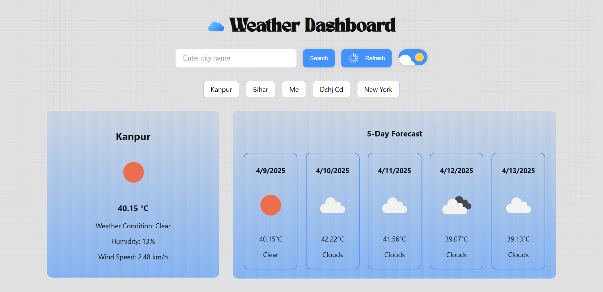
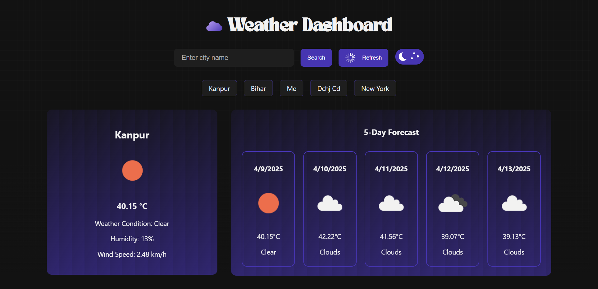
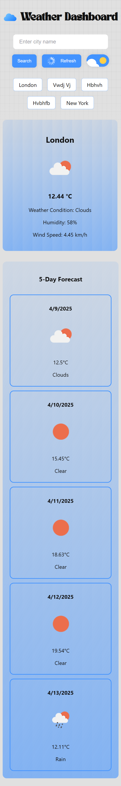
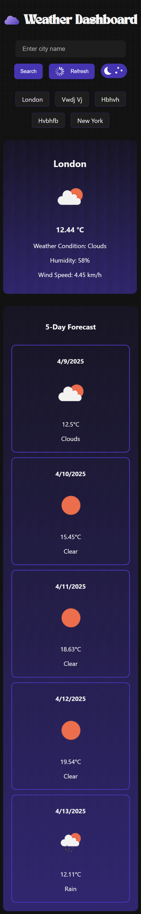

# <span style="color:green">☁️ Weather Dashboard — Zynetic Coding Assignment

A responsive weather dashboard built with **React + Vite**, styled using **Styled Components**, and powered by the **OpenWeatherMap API**. I created this  project as part of the Zynetic Frontend Assignment.
---
## 🌐 You Can Find My Site Here:[https://samir54883.github.io/Zynetic-Coding-Assignment-/](https://samir54883.github.io/Zynetic-Coding-Assignment-/)

---

## 🚀 Tech Stack

- **Frontend Framework:** React (with Vite)
- **Styling:** Styled Components with dark/light theming
- **HTTP:** Fetch API
- **Weather Data:** OpenWeatherMap API
- **Animation & UI Polish:** CSS keyframes, personally made animated components
- **Font For Title:** TAN-NIMBUS
- **State Management:** React Hooks + localStorage

---

## </> Features

- 🔍 Search for any city and get live weather data
- 📆 View 5-day / 3-hour forecast
- ♻️ Refresh button to refetch weather for the current city
- 🌗 Dark & Light theme toggle with animated UI switch
- 🧠 Recent search history (stored locally)
- 📌 Animated loader, stylish glassmorphism UI, and a fade effect grid background

---

## 🔥😎 <span style="color:green">Preview</span>

I made this website with a focus on details to be proud of what I make!  
Even the simple looking page that I have made has **a lot of key details to notice**.  
I started with a simple layout and API call to test if the functionality is working and once confirmed, I made the Front-End a lot better.

- Firstly, adding **glassmorphism design** to the `WeatherCard` and `ForecastCard`
- Then a **really well-designed theme toggle button** with switch animation
- Upon finishing, added **borders**, and **hover effect** throughout the page
- Added **scale-up effect** for the past 5 days data visible for every city
- Added an **active effect for the search bar** to leave no component boring
- Achieved a perfect sync of **classy effects and light/dark color code**
- The **refresh button** had to get its own infinitely moving animation
- And if you get the chance of waiting longer than usual, you will surely explore the **well-made loading animation** that matches with the desired theme

> 💡 The goal was to make the page **minimal in style** yet **effectively designed**.

### 🌞 Light Mode


### 🌙 Dark Mode


<span style="color:green"> 😎 check the light mode and dark mode for phone as images in the end because of their long size
---

## 📁 Folder Structure

```
src/
├── App.jsx               # Main app component where layout, state, and logic come together
├── main.jsx              # App entry point that mounts React to the DOM
│
├── assets/               # Static assets that were used : png and custom fonts
│   ├── TAN-NIMBUS.otf    # Custom font used for branding the title in app.jsx
│   ├── LIGHT-CLOUD.png   # Light theme cloud icon for the header
│   └── DARK-CLOUD.png    # Dark theme cloud icon for the header
│
├── components/           # Reusable UI components
│   ├── ErrorMessage.jsx  # Displays user-friendly error messages, with the code able to catch multiple errors 
│   ├── ForecastCard.jsx  # Displays 5-day / 3-hour forecast cards
│   ├── Loader.jsx        # Shows animated loading spinner while fetching data, coded to support both light and dark theme 
│   ├── SearchBar.jsx     # Input field and buttons for searching and toggling theme, wrapped properly for different screen sizes 
│   └── WeatherCard.jsx   # Displays current weather information for the selected city as asked in the report
│
├── hooks/                # Custom React hooks
│   └── useWeather.jsx    # Custom hook to fetch current and forecast weather data
│
└── styles/               # Theme and global style configurations
    └── theme.js          # Light and dark theme definitions (colors, gradients, etc.)

# .env file was stored outside src, near package.json 
```

---

## 🌐 API Integration

### 🔗 OpenWeatherMap

- **Current Weather API:**  
  `https://api.openweathermap.org/data/2.5/weather?q={city}&appid={API_KEY}&units=metric`

- **5-Day / 3-Hour Forecast API:**  
  `https://api.openweathermap.org/data/2.5/forecast?q={city}&appid={API_KEY}&units=metric`

### <span style="color:red"> API Key Instructions</span> 

- Visit: [https://openweathermap.org/api](https://openweathermap.org/api)
- Sign up and generate an API key
- Add it to a `.env` file in your project root:

```
VITE_WEATHER_API_KEY=your_api_key_here
```

### <span style="color:red">API Rate Limits (Free Tier)</span>

- 60 calls/minute
- 1,000,000 calls/month

---

## 🛠️ Setup Instructions

1. **Clone the Repository**

   ```bash
   git clone https://github.com/samir54883/Zynetic-Coding-Assignment-/tree/main
   cd weather-dashboard
   ```

2. **Install Dependencies**

   ```bash
   npm install
   ```

3. **Configure Environment Variables**

   Create a `.env` file:

   ```env
   VITE_WEATHER_API_KEY=your_api_key_here
   ```

4. **Start the Development Server**

   ```bash
   npm run dev
   ```
---
## <span style="color:lightgreen"> Background & UI Design - A little detailed with facts </span>

- The dashboard features a **layered animated glassmorphism UI** that adapts beautifully across light and dark modes.

- <span style="color:lightgreen"><strong>Dynamic Grid Background</strong></span>
    - Implemented using layered CSS gradients to mimic a subtle dotted paper effect.
    - The pattern changes based on the theme:
        - **Light Theme:** Uses `#4444440A` to create a soft vertical and horizontal grid.
        - **Dark Theme:** Uses `#8888880A` to maintain visibility on darker backgrounds.
    - A **bottom fade effect** is added using a `::after` gradient layer:
      ```css
      background: linear-gradient(to bottom, rgba(0, 0, 0, 0) 60%, theme.body 100%);
      ```

- <span style="color:lightgreen"><strong>Glassmorphism Cards</strong></span>
     - Both the current weather card and 5-day forecast cards use:
        - `backdrop-filter: blur(20px)`
        - `linear-gradient(...)` filled with theme-based start and end colors (`glassStart`, `glassEnd`)
        - `theme.glassBorder` to define clean card edges

- <span style="color:lightgreen"><strong>Theme-Aware Animations</strong></span>
    - Components like forecast items slightly **scale on hover** (`transform: scale(1.05)`)
    - Buttons and loaders inherit `theme.button`, `theme.pulse1`, and `theme.pulse2` for vibrant consistency

- <span style="color:lightgreen"><strong>Typography</strong></span>
    - The title "Weather Dashboard" uses the elegant **TAN-NIMBUS** font loaded via `@font-face`
    - Adaptive font sizing for small screens ensures legibility

- <span style="color:lightgreen"><strong>Responsive Design</strong></span>
    - Cards resize using media queries (`max-width: 768px`, `480px`, `380px`) to fit tablets and mobile layouts
    - Forecast cards wrap neatly, maintaining equal spacing

- <span style="color:lightgreen"><strong>Theme Configuration</strong></span>
    - Themes are declared in `theme.js` and switched dynamically using a toggle:
        - Light theme uses shades of **blue**
        - Dark theme uses shades of **violet**
    - All UI elements (buttons, borders, text, loader colors) respond to theme changes

---

## <span style="color:skyblue">📜 License

This project was made by me for **educational and assignment purposes**.  
You can feel free to **customize**, **extend**, or **deploy** it for learning and demonstration.

---

## 💡 Acknowledgements

- [OpenWeatherMap API](https://openweathermap.org/api) – for weather data
- [TAN Type](https://tan-type.com/) – for the **TAN-NIMBUS** font
- [Vite](https://vitejs.dev/) – for a **blazing fast** development experience

---

### 🌞 Light Mode for Phone


### 🌙 Dark Mode for phone

